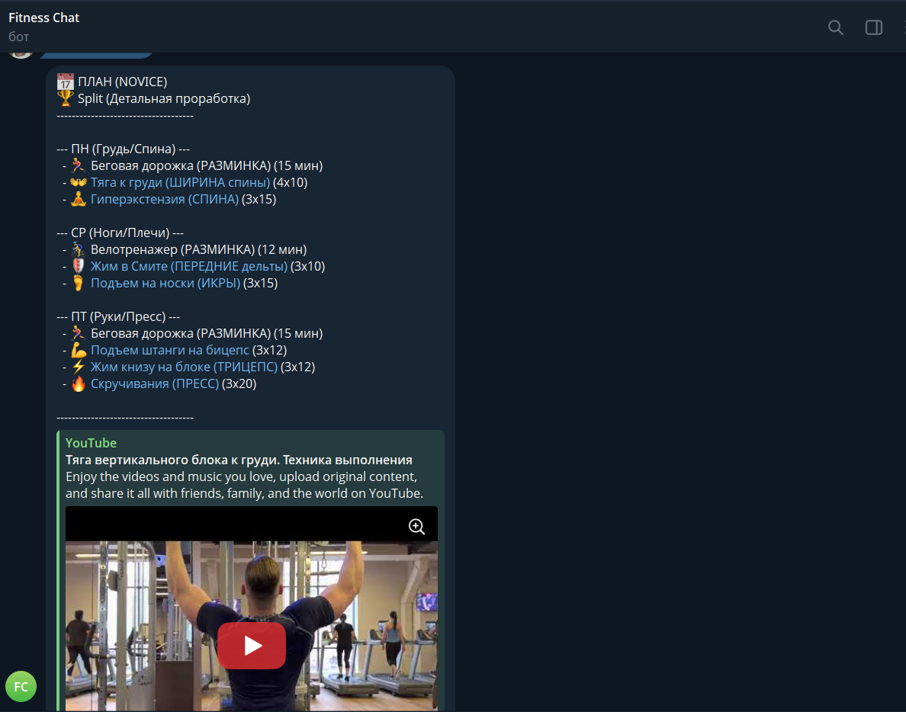
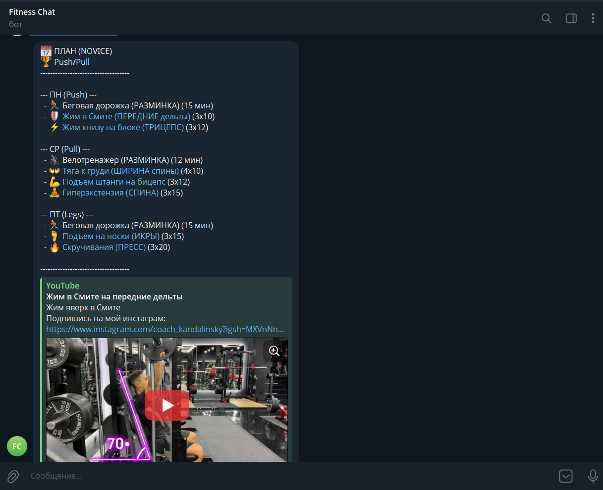
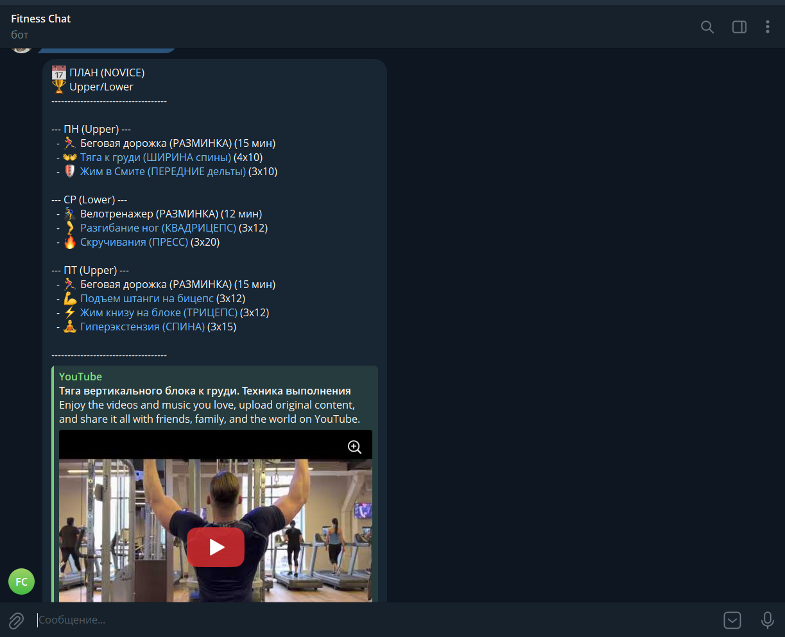
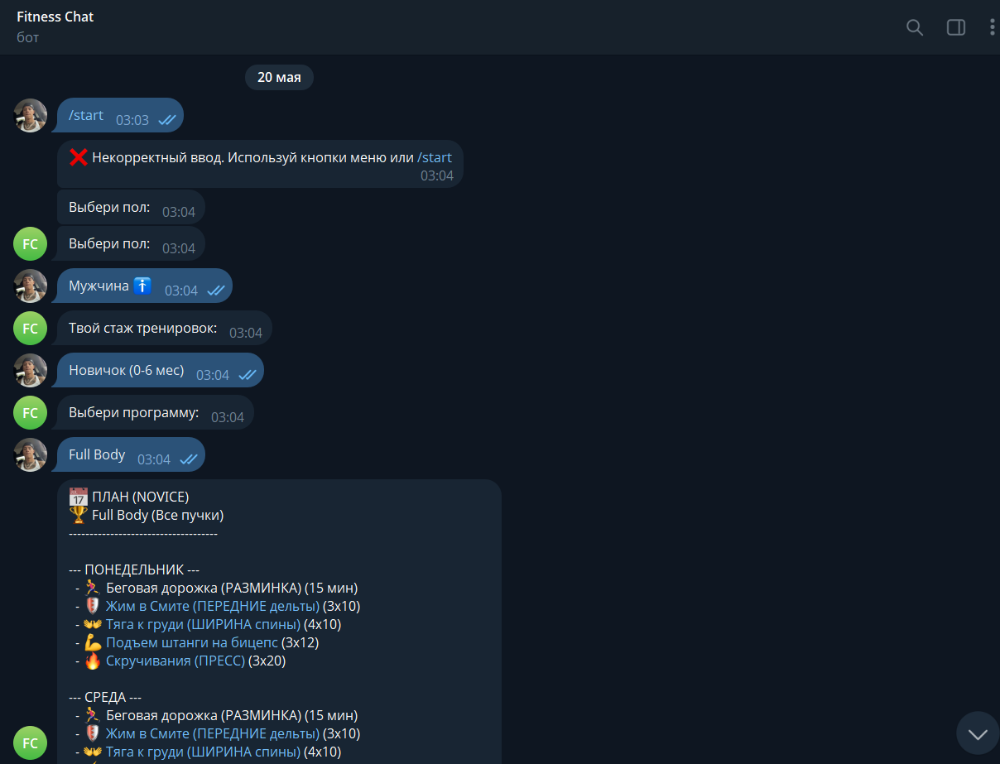
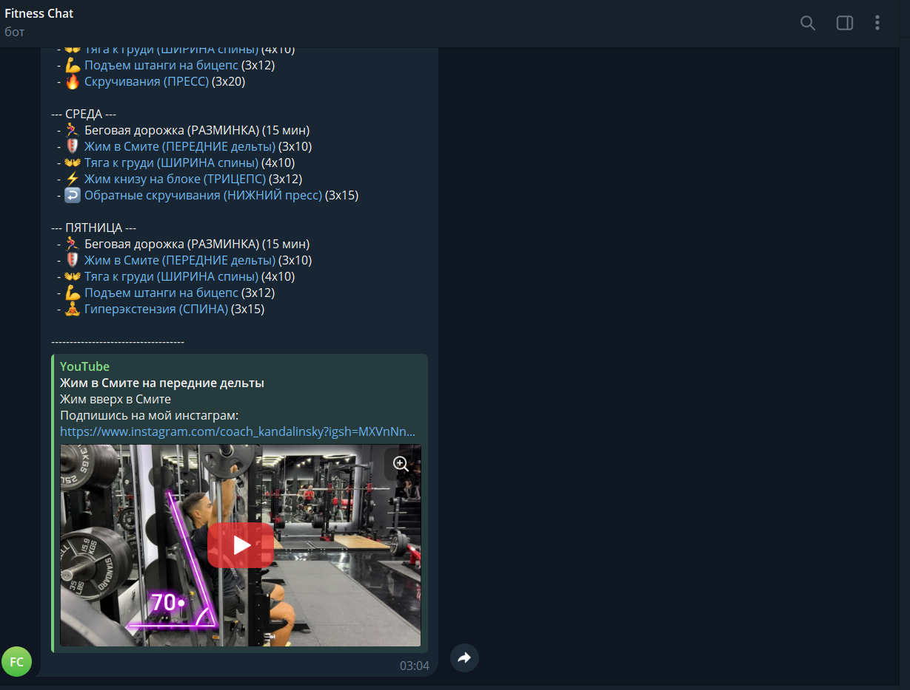

# Fitness Chatbot (Hybrid Chatbot)

## Project Description
An intelligent fitness workout program selection system tailored to the user's gender and training experience. Includes automatic registration and real-time logging of all user activities into a database.

## Technologies Used
- Python 3
- Django ORM & Django Admin
- pyTelegramBotAPI
- SQLite Database

## Installation Instructions
1. Extract the project archive.
2. Install the required libraries:
   pip install -r requirements.txt

## Running the Application
1. Start the Django web server and database:
   python manage.py runserver
2. In a separate terminal window, start the Telegram bot:
   python manage.py run_bot
3. Go to the admin panel to monitor logs: http://127.0.0.1:8000/admin/

## Screenshots

